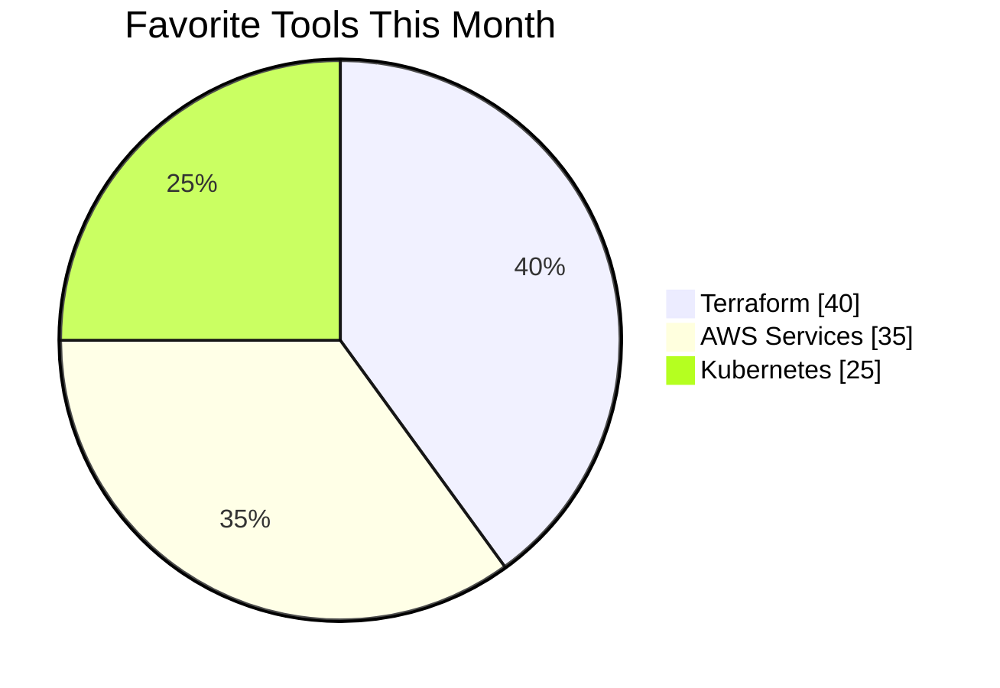

<div align="center">
  
</div>

<h1 align="center">Elegant Engineering Meets Creativity</h1>

<p align="center">
  <i>Cloud-native Engineer | IaC Specialist | AWS Infrastructure Designer</i>
</p>

<p align="center">
  <a href="https://www.terraform.io"></a>
  <a href="https://aws.amazon.com"></a>
  <a href="https://kubernetes.io"></a>
</p>

---

## 🧩 About Me

I'm a cloud-native engineer who believes infrastructure should be not only scalable, but elegant.  
I craft clean, maintainable infrastructure with Terraform, AWS, and Kubernetes, treating code as both architecture and art.

My approach blends technical precision with design sensibility—infrastructure that works beautifully and looks beautiful in its structure.

I don't just deploy resources; I orchestrate systems where every component has purpose, documentation is impeccable, and complexity transforms into elegant simplicity.

---

## 🛠️ Current Status

```yaml
🔭 Currently working on: Refactoring AWS multi-region infrastructure modules
📍 Location: Seoul, South Korea
🕰️ Last active: <!--LAST_ACTIVE-->
```

---

## 📊 Technical Preference



---

## 🌍 Global Identity

- Fluent in Korean 🇰🇷 & English 🇺🇸  
- Experienced working with global remote teams (🇺🇸 🇸🇬 🇩🇪)  
- Dev advocate for Infrastructure as Code and scalable architecture

---

## 🚀 Project Highlights

| Project | Stack | Description |
|--------|-------|-------------|
| **InfraVerse** | Terraform + AWS | Multi-region reusable infrastructure architecture with modular design |
| **KubeCharm** | Kubernetes + Helm | Microservice-based deployment automation toolkit with elegant patterns |
| **SAMtrix** | AWS SAM + Lambda | Serverless application infrastructure templating package with best practices |

---

## 💻 Tech Stack Architecture

<div align="center">
  <table border="0">
    <tr>
      <td align="center" width="96"> 
        
        <br>Terraform
      </td>
      <td align="center" width="96">
        
        <br>AWS
      </td>
      <td align="center" width="96">
        
        <br>Kubernetes
      </td>
    </tr>
    <tr>
      <td align="center" width="96">
        
        <br>Docker
      </td>
      <td align="center" width="96">
        
        <br>Python
      </td>
      <td align="center" width="96">
        
        <br>GitHub
      </td>
    </tr>
  </table>
</div>

---

## 📫 Connect With Me

<p align="center">
  <a href="https://linkedin.com/in/shashax42"></a>
  <a href="mailto:contact@shashax42.dev"></a>
  <a href="https://github.com/shashax42"></a>
</p>

---

<p align="center"><i>Tip: Try opening the console. There's always more than meets the eye...</i></p>

<!-- Easter Egg: 숨겨진 콘솔 메시지 -->
<script type="text/javascript">
  console.log(`
  ✨ Expecto Patronum! You found the secret. ✨
  
  I believe elegant infrastructure is like a well-designed building—
  beautiful on the outside, but even more impressive when you
  understand the engineering principles holding it together.
  
  If you appreciate both form AND function, we should connect:
  contact@shashax42.dev
  `);
</script>
