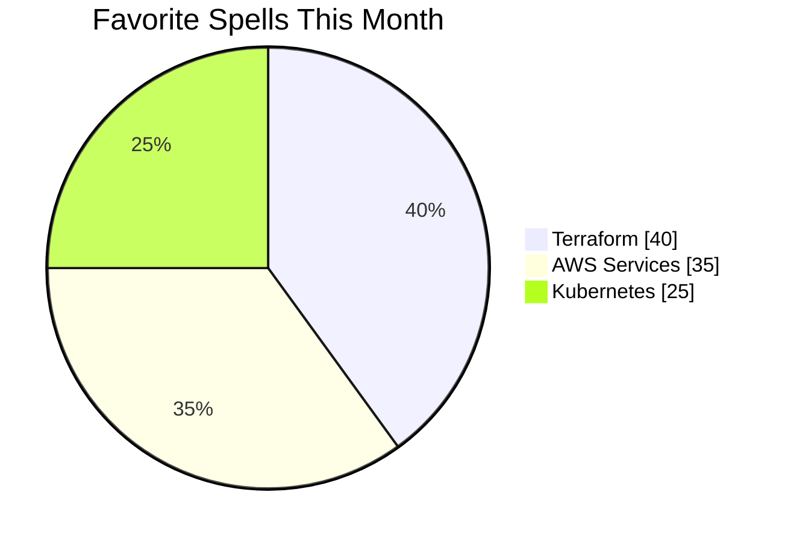

<!-- GitHub 프로필 헤더 배너 -->  
<div align="center">
  
</div>

<h1 align="center">✨ Crafting Elegant Infrastructure with Cloud & Magic ✨</h1>

<p align="center">
  <i>Cloud Architect | Terraform Sorceress | AWS Enchantress</i>
</p>

<p align="center">
  <a href="https://www.terraform.io"></a>
  <a href="https://aws.amazon.com"></a>
  <a href="https://kubernetes.io"></a>
</p>

---

## 🧚 About Me

I'm a cloud-native engineer who builds elegant, reproducible, and resilient infrastructures.

- 🌸 Specializing in AWS, Terraform, and Kubernetes  
- 🪄 Creating scalable cloud systems with style  
- 🌍 Fluent in Korean 🇰🇷 & English 🇺🇸  
- 🎀 Obsessed with clean architectures and graceful automation  

My design philosophy merges **technical precision** with **aesthetic elegance**—because infrastructure should be as beautiful in its structure as it is reliable in its function.

---

## 🔮 Currently Building

```yaml
🛠️ Currently working on: Elegant Multi-Region Infra Modules
📍 Location: Seoul, South Korea
🕰️ Last active: <!--LAST_ACTIVE-->
✨ Inspiration level: Seeking magical cloud architectures
```

---

## 📊 Technical Enchantments



---

## ✨ Selected Projects

| Project | Stack | Description |
|---------|-------|-------------|
| **VelvetInfra** 💎 | Terraform + AWS | Scalable infrastructure templates with royal-level organization and documentation |
| **KubeCharm** 🔮 | Kubernetes + Helm | Microservice orchestration that works like magic, with elegant deployment patterns |
| **CloudRoyale** 👑 | AWS + Python | Multi-account governance suite with graceful controls and immaculate audit trails |

---

## 🌎 Global Connections

- Fluent in Korean 🇰🇷 & English 🇺🇸  
- Experienced with global remote teams (🇺🇸 🇸🇬 🇩🇪)  
- Advocate for elegant infrastructure design and documentation
- Spreading the gospel of Infrastructure as Code with style and grace

---

## 🏰 Tech Architecture

<p align="center">
  &nbsp;&nbsp;
  &nbsp;&nbsp;
  
</p>

<p align="center">
  &nbsp;&nbsp;
  &nbsp;&nbsp;
  
</p>

---

## 💌 Royal Correspondence

<p align="center">
  <a href="https://linkedin.com/in/shashax42"></a>
  <a href="mailto:contact@shashax42.dev"></a>
  <a href="https://github.com/shashax42"></a>
</p>

---

<p align="center">
  ✨ <i>Tip: Try opening the console. There's always a little magic hidden away...</i> ✨
</p>

<!-- GitHub에서는 JavaScript가 실행되지 않지만, 이스터 에그로 콘솔 메시지를 남겨둡니다 -->
<!-- 
✨👑✨ You found the royal secret! ✨👑✨
  
Welcome to my elegant cloud kingdom, where infrastructure
is treated with the reverence of high art and the precision
of royal craftsmanship.
  
I believe technology should be both beautiful and functional—
like a palace that's as stunning in its architecture as it
is thoughtful in its design.
  
Would you like to collaborate on creating something magnificent?
contact@shashax42.dev
-->

