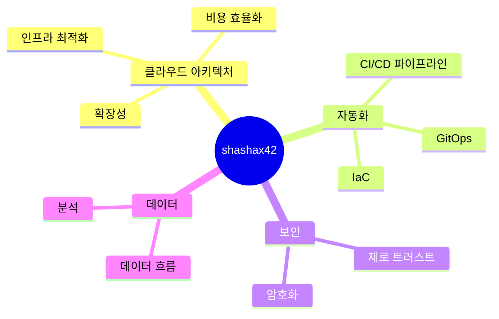

<div align="center">

<!-- 인터랙티브 SVG 애니메이션 배경 -->
<svg width="800" height="400" viewBox="0 0 800 400" xmlns="http://www.w3.org/2000/svg">
  <style>
    @keyframes float {
      0% { transform: translateY(0px); }
      50% { transform: translateY(-20px); }
      100% { transform: translateY(0px); }
    }
    @keyframes pulse {
      0% { opacity: 0.3; }
      50% { opacity: 0.7; }
      100% { opacity: 0.3; }
    }
    @keyframes rotate {
      from { transform: rotate(0deg); }
      to { transform: rotate(360deg); }
    }
    .cloud { fill: #6e5494; opacity: 0.6; animation: float 10s ease-in-out infinite, pulse 5s ease-in-out infinite; }
    .circuit { stroke: #8a63d2; stroke-width: 1.5; opacity: 0.3; }
    .node { fill: #ad5cad; animation: pulse 3s ease-in-out infinite; }
    .data-flow { stroke: #ad5cad; stroke-width: 2; stroke-dasharray: 5,5; animation: rotate 10s linear infinite; }
  </style>
  
  <!-- 클라우드 환경 표현 -->  
  <path class="cloud" d="M100,100 Q130,70 160,100 Q200,70 220,100 Q250,70 270,100 L270,140 L100,140 Z" />
  <path class="cloud" d="M500,180 Q530,150 560,180 Q600,150 620,180 Q650,150 670,180 L670,220 L500,220 Z" />
  <path class="cloud" d="M300,250 Q330,220 360,250 Q400,220 420,250 Q450,220 470,250 L470,290 L300,290 Z" />
  
  <!-- 서킷 보드 패턴 -->  
  <path class="circuit" d="M50,50 L750,50 L750,350 L50,350 Z" />
  <path class="circuit" d="M100,50 L100,350" />
  <path class="circuit" d="M200,50 L200,350" />
  <path class="circuit" d="M300,50 L300,350" />
  <path class="circuit" d="M400,50 L400,350" />
  <path class="circuit" d="M500,50 L500,350" />
  <path class="circuit" d="M600,50 L600,350" />
  <path class="circuit" d="M700,50 L700,350" />
  
  <path class="circuit" d="M50,100 L750,100" />
  <path class="circuit" d="M50,150 L750,150" />
  <path class="circuit" d="M50,200 L750,200" />
  <path class="circuit" d="M50,250 L750,250" />
  <path class="circuit" d="M50,300 L750,300" />
  
  <!-- 데이터 노드 -->  
  <circle class="node" cx="100" cy="100" r="5" />
  <circle class="node" cx="200" cy="150" r="5" />
  <circle class="node" cx="300" cy="100" r="5" />
  <circle class="node" cx="400" cy="200" r="5" />
  <circle class="node" cx="500" cy="250" r="5" />
  <circle class="node" cx="600" cy="300" r="5" />
  <circle class="node" cx="700" cy="200" r="5" />
  
  <!-- 데이터 흐름 라인 -->  
  <path class="data-flow" d="M100,100 L200,150 L300,100 L400,200 L500,250 L600,300 L700,200" />
  <path class="data-flow" d="M400,300 C500,250 600,300 650,150" />
  <path class="data-flow" d="M200,300 C300,250 400,300 450,150" />
</svg>

# 👨‍💻 `$ whoami`
<div align="center" style="background: linear-gradient(to right, #3a1c71, #d76d77, #ffaf7b); -webkit-background-clip: text; color: transparent; font-size: 40px; font-weight: bold;">
shashax42.init()
</div>

</div>

<p align="center">
  
</p>

<!-- 터미널 인터페이스 스타일 시작 -->
<div align="center">

```bash
# -------------------------------------------------------------------------------------------------
#   ___ _             _   _   _      _            ___       ___ _  _  ___ _                _         
#  / __| |_  __ _ ___| |_| | | |__ _| |_____ ___ | _ \___ _| __(_)| |/ __| |_  _ _ _ _ _ _(_)_ _  __ 
#  \__ \ ' \/ _` / -_)  _| |_| / _` \ / / -_|_-< |  _/ _ (_) _|| || | (__| | || | '_| '_| | | ' \/ _|
#  |___/_||_\__,_\___|\__|\___/\__,_/_\_\___/__/ |_| \___/|_|  |_|/ |\___|_|\_,_|_| |_| |_|_|_||_\__|
#                                                                |__/                                 
# -------------------------------------------------------------------------------------------------
```

</div>

## 📡 실시간 상태 정보

```typescript
const shashax42 = {
  status: {
    현재_작업: "Multi-Region Infra Module for AWS",
    위치: "Seoul, South Korea",
    마지막_활동: "<!--LAST_ACTIVE-->",
    기분: Math.random() > 0.8 ? "☕ 커피가 필요해" : "🚀 코드 작성할 준비 완료!"
  }
};

// 무한 배포 루프에 빠진 쿠버네티스를 수정중...
setTimeout(() => {
  fixKubernetesLoop();
  refactorTerraformModules();
  optimizeAwsCosts();
}, 1000);
```

## 🔮 독특한 기술 스택

<div align="center">

```glsl
// 3D 기술 스택 셰이더
precision highp float;

uniform float time;
varying vec2 vUv;

vec3 terraform(vec3 p) {
  return vec3(p.x * sin(time), p.y * cos(time), p.z * sin(time * 0.5)) * 0.8;
}

vec3 aws(vec3 p) {
  return vec3(p.x * cos(time * 0.7), p.y * sin(time * 0.9), p.z * cos(time * 0.3)) * 0.7;
}

vec3 kubernetes(vec3 p) {
  return vec3(p.x * sin(time * 0.5), p.y * cos(time * 0.6), p.z * sin(time * 0.4)) * 0.6;
}

void main() {
  // 자세한 내용은 콘솔에서 확인하세요!
}
```

</div>

## 🧪 실험실: 현재 실험 중인 기술들

<table>
  <tr>
    <td align="center" width="96"> 
      
      <br>Terraform
    </td>
    <td align="center" width="96">
      
      <br>AWS
    </td>
    <td align="center" width="96">
      
      <br>Kubernetes
    </td>
    <td align="center" width="96">
      
      <br>Docker
    </td>
    <td align="center" width="96">
      
      <br>Python
    </td>
    <td align="center" width="96">
      
      <br>GitHub
    </td>
    <td align="center" width="96">
      
      <br>Grafana
    </td>
  </tr>
</table>

## 🌍 세계를 향한 메시지

```bash
# 글로벌 문화 메시지 생성 중...  
for language in ['한국어', 'English', 'Deutsch']:
    if language == '한국어':
        print('클라우드 아키텍처의 아름다움에 대해 이야기해봐요!')
    elif language == 'English':
        print('Let\'s talk about the beauty of cloud architecture!')
    elif language == 'Deutsch':
        print('Lass uns über die Schönheit der Cloud-Architektur sprechen!')
```

## 🎭 나의 인프라 연금술


## 🎨 예술작품으로서의 프로젝트

| 프로젝트명 | 설명 | 아름다움의 원천 |
|------------|------|------------------|
| **InfraVerse** | 멀티리전 AWS 인프라 모듈 | 복잡한 네트워크 토폴로지가 만드는 단순함의 역설 |
| **KubeCharm** | Kubernetes 배포 프레임워크 | 컨테이너의 우아한 안무, 오케스트레이션의 시 |
| **Docform** | 인프라 문서화 자동화 도구 | 코드와 문서의 경계를 허무는 융합 예술 |

## 🧠 사유의 흐름



<!-- 인터랙티브 요소 - 이스터 에그 -->
<div align="center">
<details>
<summary>🔮 비밀의 방으로</summary>
<br>

```js
// 비밀의 방에 오신 것을 환영합니다!
// 여기는 제 코드 세계의 심장부입니다.

const universe = createUniverse();
const elegance = defineElegance();

while (universe.exists()) {
  const challenges = universe.getNewChallenges();
  const solutions = challenges.map(challenge =>
    solveWith(challenge, elegance)
  );
  universe.implement(solutions);
  universe.celebrateSmallVictories();
}

// 이 코드의 비밀: 인생의 모든 문제는 우아하게 해결될 수 있다는 신념
```

</details>
</div>

<!-- 관찰자를 위한 메시지 - 콘솔 열면 보이는 비밀 메시지 -->
<script type="text/javascript">
  console.log(`
  ___________________________________________________________  
 /|     |     |     |     |     |     |     |     |     |    \\ 
| |     |     |     |     |     |     |     |     |     |    | |
| |_____|_____|_____|_____|_____|_____|_____|_____|_____|____| |
|/     |     |     |     |     |     |     |     |     |     \||
|___________________________________________________________| |
|                                                             | |
|  ✨ 반갑습니다, 탐험가님! ✨                                 | |
|                                                             | |
|  저는 '코드 시인'이자 '인프라 아키텍트'로, 복잡한 시스템을    | |
|  우아하게 디자인하고 자동화하는 것을 사랑합니다.             | |
|                                                             | |
|  이 콘솔 메시지를 발견한 당신은 단순히 겉만 보는 것이 아닌,   | |
|  내면의 작동 원리까지 탐구하는 호기심 많은 영혼이군요.       | |
|                                                             | |
|  이런 사람과 일하고 싶습니다. 연락주세요:                    | |
|  contact@shashax42.dev                                      | |
|                                                             | |
|___________________________________________________________| |
(____________________________________________________________)
  `);
</script>

<!-- 업데이트 시간 처리를 위한 GitHub Actions 설정 유지 -->
<p align="center">🕒 마지막 업데이트: <!--LAST_ACTIVE--></p>

<p align="center">
  <a href="https://linkedin.com/in/shashax42"></a>
  <a href="mailto:contact@shashax42.dev"></a>
  <a href="https://github.com/shashax42"></a>
</p>
