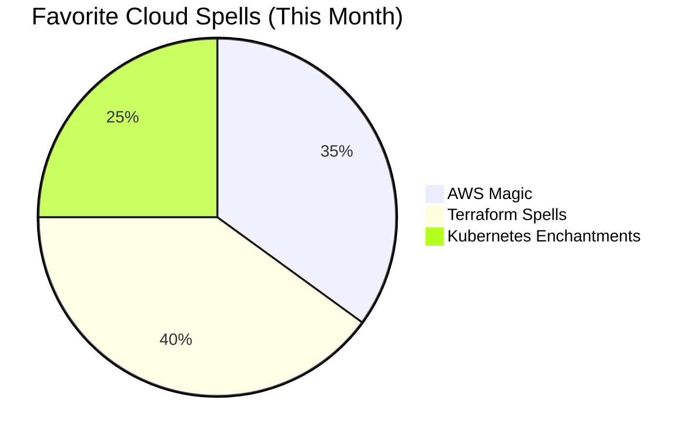

<div align="center">
  
  <br>
  
</div>

<table align="center">
<tr>
<td>

```yaml
⚡ Realm: Cloud Magic Castle in AWS Kingdom
💎 House: Terraform Ravenclaw 🦅
🔮 Patronus: High-Availability Dragon
🏰 Royal Title: Archmage of Infrastructure
🌟 Prophecy: "She who masters the cloud shall bridge
      the worlds of reality and digital magic"
```

</td>
<td>


</td>
</tr>
</table>

<h2 align="center">⚡ Cloud Engineering Journey ⚡</h2>

```diff
+ Behind every cloud service lies infrastructure as magical as any spell +
- I am a Wizard of the AWS Kingdom and Guardian of Digital Magic -
! Harmonizing the elegance and power of infrastructure with finesse !
# Creating new worlds beyond cloud boundaries with XR/MR holograms #
```

<details>
<summary><b>🧙‍♀️ Cloud Spells Mastery (Expand)</b></summary>
<br>

| Magical Spell | Effect | Difficulty |
|---------|------|--------|
| `Infrastructurus Terraformae` | Transform infrastructure into code and deploy to desired state | ⭐⭐⭐⭐ |
| `Kubernetum Leviosa` | Levitate containers for orchestration | ⭐⭐⭐⭐⭐ |
| `AWS Alohomora` | Grant secure access to cloud resources with IAM permissions | ⭐⭐⭐ |
| `Holographicus Totalus` | Visualize infrastructure as holograms through XR/MR | ⭐⭐⭐⭐⭐ |
| `Serverless Patronum` | Optimize costs and scalability with serverless architectures | ⭐⭐⭐⭐ |

</details>

<h2 align="center">✨ Current Magical Projects ✨</h2>

<div align="center">

```yaml
🧙‍♀️ Currently Crafting: Multi-Region Magical Infrastructure Modules with AWS+Hologram
🏰 Location: Seoul, South Korea - Digital Magic Castle
🔮 Last Spell Cast: <!--LAST_ACTIVE-->
💫 Inspiration Level: Exploring magical cloud architectures
```

</div>

<h2 align="center">🧙‍♀ Magical Tech Statistics 🧙‍♀</h2>

<!-- Showing frequency of spell usage -->
<div align="center">
  
  
</div>



<h2 align="center">🏰 Key Projects from the Magic Kingdom 🏰</h2>

<table align="center">
  <tr>
    <td align="center">
      <br>
      <b>Hologram Castle</b> ✨
    </td>
    <td>
      <b>HoloCastle</b> - AWS + Hologram Technology<br>
      <i>Cloud resource visualization using XR/MR technology. A 3D holographic interface that allows control of infrastructure and creation of resources through magical gestures.</i>
    </td>
  </tr>
  <tr>
    <td align="center">
      <br>
      <b>Sorting Hat</b> 🧙
    </td>
    <td>
      <b>SortingInfra</b> - Terraform + AWS + ML<br>
      <i>A magical solution that automatically analyzes workloads and recommends the optimal AWS service and infrastructure configuration. Just like the Hogwarts Sorting Hat, it assigns each application to the most suitable cloud 'house'.</i>
    </td>
  </tr>
  <tr>
    <td align="center">
      <br>
      <b>Glass Slipper Pipeline</b> 👠
    </td>
    <td>
      <b>GlassSlipperCI</b> - AWS + GitOps + ML<br>
      <i>CI/CD system that guarantees perfect deployment before midnight. Uses ML to prioritize tests to meet deadlines and prepares perfectly for meeting the Prince (production).</i>
    </td>
  </tr>
</table>

<h2 align="center">🌟 Magical World Connections 🌟</h2>

<div align="center">

🇰🇷 Fluent in Korean & 🇺🇸 English  
🏰 Experience with global remote wizard teams (🇺🇸 🇸🇬 🇩🇪)  
💫 Advocate for elegant infrastructure design and documentation  
✨ Spreading the gospel of Infrastructure as Code with style and grace  

</div>

<h2 align="center">💎 Magical Tech Stack 💎</h2>

<div align="center">

|  |  |  |
|:---:|:---:|:---:|
| **AWS** | **Kubernetes** | **Terraform** |

|  |  |  |
|:---:|:---:|:---:|
| **Docker** | **Python** | **XR/MR** |

</div>

<h2 align="center">📫 Contact Through the Magic Mirror 📫</h2>

<div align="center">

[](https://linkedin.com/in/shashax42)
[](mailto:contact@shashax42.dev)
[](https://github.com/shashax42)

</div>

<div align="center">
  
</div>

<div align="center">
  
</div>

<p align="center">
  <!-- Snake animation will be activated after GitHub Actions setup -->
  
</p>

<div align="center">
  
</div>

<!-- Console Easter Egg -->
<!-- 
✨👑✨ You've discovered the magical spell! ✨👑✨
  
Welcome to the wizard's cloud kingdom.
This is where infrastructure reaches the realm of art,
and code becomes magical incantations.
  
Shall we create a new cloud experience together that
transcends the boundaries of reality and digital worlds
through XR and MR holograms?
  
If you want to create something magical together:
contact@shashax42.dev
-->

