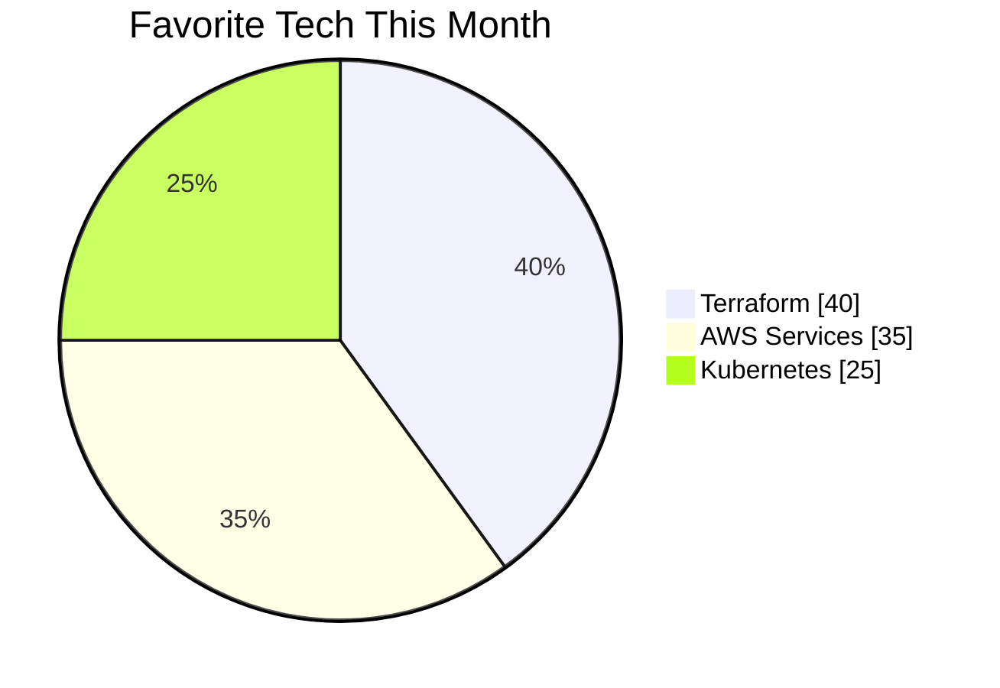

<h1 align="center">Elegant Engineering Meets Creativity 👑</h1>

<p align="center"><i>Cloud-native Engineer | DevOps Visionary | AWS Infrastructure Designer</i></p>

<p align="center">
  
</p>

---

### 🧩 Who Am I?

I'm `shashax42`, a cloud-native engineer crafting elegant, scalable infrastructure using Terraform, AWS, and Kubernetes.  
I focus on clean architecture, resilient deployment pipelines, and creating systems that grow beautifully.

---

### 🚀 Projects at a Glance

| Name | Stack | Focus |
|------|-------|-------|
| **InfraVerse** | Terraform + AWS | Multi-region reusable infra module |
| **KubeCharm** | Kubernetes + Helm | CI/CD-ready deployment framework |
| **Docform** | Python + OpenAPI | Auto-generated Infra Documentation tool |

---

### 🧘‍♀️ Current Status

```yaml
🔭 Currently working on: Multi-Region Infra Module for AWS
📍 Location: Seoul, South Korea  
🕰️ Last active: <!--LAST_ACTIVE-->
```

---

### 📈 My Tech Footprint



---

### 🌍 Global Identity

- Fluent in Korean 🇰🇷 & English 🇺🇸  
- Experienced with global remote teams (🇺🇸 🇸🇬 🇩🇪)  
- Dev advocate for **infrastructure as code** and **cloud-native culture**

---

### 💻 Tech Stack

<p align="center">
  <a href="https://aws.amazon.com"></a>
  <a href="https://www.terraform.io"></a>
  <a href="https://kubernetes.io"></a>
  <a href="https://www.docker.com"></a>
  <a href="https://www.python.org"></a>
  <a href="https://go.dev"></a>
</p>

---

### 📫 Let's Connect

<p align="center">
  <a href="https://linkedin.com/in/shashax42"></a>
  <a href="mailto:contact@shashax42.dev"></a>
  <a href="https://github.com/shashax42"></a>
</p>

---

<p align="center">🪄 <i>Tip: Try opening the console — there's a little magic hidden there...</i></p>

<div align="center">
<!-- 이스터에그: 클릭 시 콘솔에 메시지 출력 -->
<script>
  document.addEventListener("click", () => {
    console.log("✨ Expecto Patronum! You found the secret.");
  });
</script>
</div>
