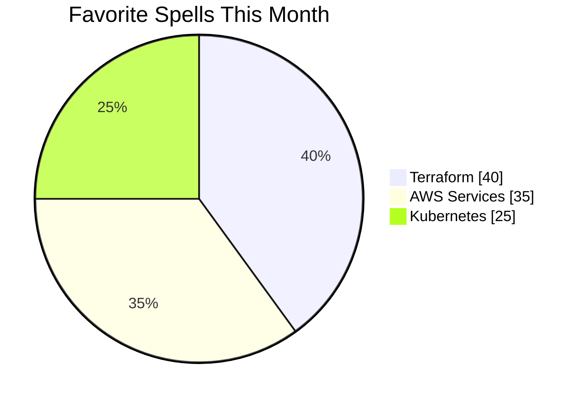

<!-- 배경 효과를 위한 스타일 -->
<style>
  .princess-bg {
    background: linear-gradient(120deg, rgba(194,158,255,0.2) 0%, rgba(225,190,231,0.2) 25%, rgba(255,240,245,0.2) 50%, rgba(225,190,231,0.2) 75%, rgba(194,158,255,0.2) 100%);
    border-radius: 16px;
    backdrop-filter: blur(8px);
    -webkit-backdrop-filter: blur(8px);
    border: 1px solid rgba(255, 255, 255, 0.3);
    padding: 20px;
    margin-bottom: 20px;
    box-shadow: 0 4px 20px rgba(123, 90, 141, 0.1);
  }
  
  .shine {
    animation: shine 3s infinite alternate;
  }
  
  @keyframes shine {
    from { opacity: 0.8; filter: drop-shadow(0 0 5px rgba(194,158,255,0.3)); }
    to { opacity: 1; filter: drop-shadow(0 0 15px rgba(194,158,255,0.6)); }
  }
  
  .tech-icon:hover {
    transform: scale(1.08) rotate(5deg);
    transition: all 0.3s ease;
  }
  
  .magic-header {
    background: linear-gradient(90deg, #C29EFF, #E1BEE7, #FFF0F5, #E1BEE7, #C29EFF);
    background-size: 400% 400%;
    -webkit-background-clip: text;
    background-clip: text;
    color: transparent;
    animation: gradient 8s ease infinite;
  }
  
  @keyframes gradient {
    0% { background-position: 0% 50%; }
    50% { background-position: 100% 50%; }
    100% { background-position: 0% 50%; }
  }
  
  .elegant-table {
    border-collapse: separate;
    border-spacing: 0;
    width: 100%;
    overflow: hidden;
    border-radius: 8px;
    box-shadow: 0 4px 12px rgba(194,158,255,0.15);
  }
  
  .elegant-table th {
    background-color: rgba(194,158,255,0.2);
    color: #483D8B;
    text-align: left;
    padding: 12px 15px;
    font-weight: 600;
    border-bottom: 2px solid rgba(194,158,255,0.3);
  }
  
  .elegant-table td {
    padding: 12px 15px;
    border-bottom: 1px solid rgba(194,158,255,0.1);
  }
  
  .elegant-table tr:hover {
    background-color: rgba(194,158,255,0.05);
  }
</style>

<!-- 상단 배너 -->  
<div align="center">
  
</div>

<h1 align="center" class="magic-header">Crafting Elegant Infrastructure with Cloud & Magic ✨</h1>

<p align="center">
  <i>Cloud Architect | Terraform Sorceress | AWS Enchantress</i>
</p>

<!-- 기술 스택 배지 -->  
<p align="center">
  <a href="https://www.terraform.io"></a>
  <a href="https://aws.amazon.com"></a>
  <a href="https://kubernetes.io"></a>
</p>

<div class="princess-bg">

## 🧚 About Me

I'm a cloud-native engineer who builds elegant, reproducible, and resilient infrastructures.

- 🌸 Specializing in AWS, Terraform, and Kubernetes  
- 🪄 Creating scalable cloud systems with style  
- 🌍 Fluent in Korean 🇰🇷 & English 🇺🇸  
- 🎀 Obsessed with clean architectures and graceful automation  

My design philosophy merges **technical precision** with **aesthetic elegance**—because infrastructure should be as beautiful in its structure as it is reliable in its function.

</div>

<div class="princess-bg">

## 🔮 Currently Building

```yaml
🛠️ Currently working on: Elegant Multi-Region Infra Modules
📍 Location: Seoul, South Korea
🕰️ Last active: <!--LAST_ACTIVE-->
✨ Inspiration level: Seeking magical cloud architectures
```

</div>

<div class="princess-bg">

## 📊 Technical Enchantments



</div>

<div class="princess-bg">

## ✨ Selected Projects

<table class="elegant-table">
  <thead>
    <tr>
      <th>Project</th>
      <th>Stack</th>
      <th>Description</th>
    </tr>
  </thead>
  <tbody>
    <tr>
      <td><b>VelvetInfra</b> 💎</td>
      <td>Terraform + AWS</td>
      <td>Scalable infrastructure templates with royal-level organization and documentation</td>
    </tr>
    <tr>
      <td><b>KubeCharm</b> 🔮</td>
      <td>Kubernetes + Helm</td>
      <td>Microservice orchestration that works like magic, with elegant deployment patterns</td>
    </tr>
    <tr>
      <td><b>CloudRoyale</b> 👑</td>
      <td>AWS + Python</td>
      <td>Multi-account governance suite with graceful controls and immaculate audit trails</td>
    </tr>
  </tbody>
</table>

</div>

<div class="princess-bg">

## 🌎 Global Connections

- Fluent in Korean 🇰🇷 & English 🇺🇸  
- Experienced with global remote teams (🇺🇸 🇸🇬 🇩🇪)  
- Advocate for elegant infrastructure design and documentation
- Spreading the gospel of Infrastructure as Code with style and grace

</div>

<div class="princess-bg">

## 🏰 Tech Architecture

<div align="center">
  <table border="0">
    <tr>
      <td align="center" width="96" class="tech-icon"> 
        
        <br>Terraform
      </td>
      <td align="center" width="96" class="tech-icon">
        
        <br>AWS
      </td>
      <td align="center" width="96" class="tech-icon">
        
        <br>Kubernetes
      </td>
    </tr>
    <tr>
      <td align="center" width="96" class="tech-icon">
        
        <br>Docker
      </td>
      <td align="center" width="96" class="tech-icon">
        
        <br>Python
      </td>
      <td align="center" width="96" class="tech-icon">
        
        <br>GitHub
      </td>
    </tr>
  </table>
</div>

</div>

<div class="princess-bg">

## 💌 Royal Correspondence

<p align="center">
  <a href="https://linkedin.com/in/shashax42"></a>
  <a href="mailto:contact@shashax42.dev"></a>
  <a href="https://github.com/shashax42"></a>
</p>

</div>

<p align="center" style="font-style:italic; color:#C29EFF;">
  ✨ <i>Tip: Try opening the console. There's always a little magic hidden away...</i> ✨
</p>

<!-- 마우스 커서 따라다니는 별 효과 -->
<script>
document.addEventListener("DOMContentLoaded", function() {
  const starContainer = document.createElement('div');
  starContainer.style.position = 'fixed';
  starContainer.style.pointerEvents = 'none';
  starContainer.style.top = '0';
  starContainer.style.left = '0';
  starContainer.style.width = '100%';
  starContainer.style.height = '100%';
  starContainer.style.zIndex = '9999';
  document.body.appendChild(starContainer);

  document.addEventListener('mousemove', function(e) {
    if (Math.random() > 0.9) {
      const star = document.createElement('div');
      star.innerHTML = '✨';
      star.style.position = 'absolute';
      star.style.left = (e.pageX - 10) + 'px';
      star.style.top = (e.pageY - 10) + 'px';
      star.style.pointerEvents = 'none';
      star.style.userSelect = 'none';
      star.style.fontSize = '16px';
      star.style.opacity = '0.8';
      star.style.animation = 'star-fade 1.5s forwards';
      starContainer.appendChild(star);

      setTimeout(() => {
        starContainer.removeChild(star);
      }, 1500);
    }
  });

  document.head.insertAdjacentHTML('beforeend', `
    <style>
      @keyframes star-fade {
        0% { transform: scale(0.5); opacity: 0.8; }
        100% { transform: scale(1.5) translate(0, -20px); opacity: 0; }
      }
    </style>
  `);
});
</script>

<!-- 콘솔 메시지 이스터 에그 -->
<script type="text/javascript">
  console.log(`
  ✨👑✨ You found the royal secret! ✨👑✨
  
  Welcome to my elegant cloud kingdom, where infrastructure
  is treated with the reverence of high art and the precision
  of royal craftsmanship.
  
  I believe technology should be both beautiful and functional—
  like a palace that's as stunning in its architecture as it
  is thoughtful in its design.
  
  Would you like to collaborate on creating something magnificent?
  contact@shashax42.dev
  `);
</script>
