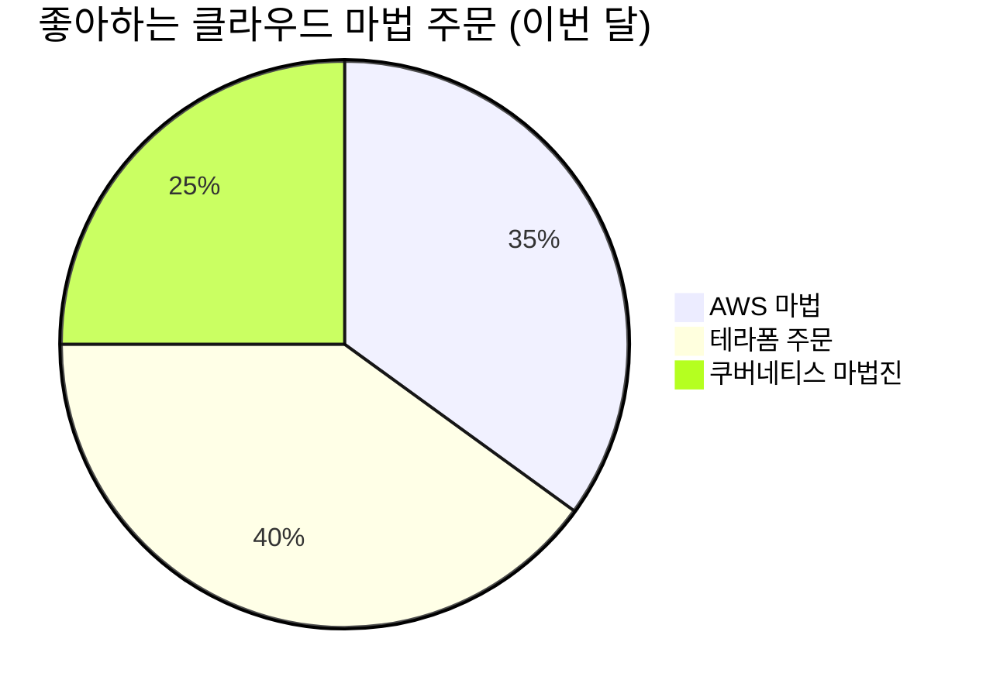

<div align="center">
  
  <br>
  
</div>

<table align="center">
<tr>
<td>

```yaml
⚡ Realm: Cloud Magic Castle in AWS Kingdom
💎 House: Terraform Ravenclaw 🦅
🔮 Patronus: High-Availability Dragon
🏰 Royal Title: Archmage of Infrastructure
🌟 Prophecy: "She who masters the cloud shall bridge
      the worlds of reality and digital magic"
```

</td>
<td>


</td>
</tr>
</table>

<h2 align="center">⚡ 클라우드 엔지니어링 여정 ⚡</h2>

```diff
+ 모든 클라우드 서비스 뒤에는 마법 같은 인프라가 있습니다 +
- 저는 AWS 왕국의 마법사이자 디지털 마법의 수호자입니다 -
! 인프라스트럭처의 아름다움과 강력함을 조화롭게 통합합니다 !
# XR/MR 홀로그램으로 클라우드의 경계를 넘어 새로운 세계를 창조합니다 #
```

<details>
<summary><b>🧙‍♀️ 공주님이 배운 클라우드 마법 주문들 (펼치기)</b></summary>
<br>

| 마법 주문 | 효과 | 난이도 |
|---------|------|--------|
| `Infrastructurus Terraformae` | 인프라를 코드로 변환하여 원하는 상태로 배포 | ⭐⭐⭐⭐ |
| `Kubernetum Leviosa` | 컨테이너들을 공중에 띄워 오케스트레이션 | ⭐⭐⭐⭐⭐ |
| `AWS Alohomora` | 클라우드 리소스에 안전하게 접근할 수 있는 IAM 권한 부여 | ⭐⭐⭐ |
| `Holographicus Totalus` | XR/MR을 통해 인프라를 홀로그램으로 시각화 | ⭐⭐⭐⭐⭐ |
| `Serverless Patronum` | 서버리스 아키텍처로 비용 최적화 및 확장성 확보 | ⭐⭐⭐⭐ |

</details>

<h2 align="center">✨ 현재 마법 프로젝트 ✨</h2>

<div align="center">

```yaml
🧙‍♀️ 현재 작업 중: AWS+홀로그램 기반 다중 리전 마법 인프라 모듈
🏰 위치: 대한민국 서울, 디지털 마법성
🔮 마지막 주문 시전: <!--LAST_ACTIVE-->
💫 영감 레벨: 마법 같은 클라우드 아키텍처 탐색 중
```

</div>

<h2 align="center">🧙‍♀ 마법 기술 통계 🧙‍♀</h2>

<!-- 마법 주문 사용 빈도를 보여주는 차트 -->
<div align="center">
  
  
</div>



<h2 align="center">🏰 마법 왕국의 주요 프로젝트 🏰</h2>

<table align="center">
  <tr>
    <td align="center">
      <br>
      <b>홀로그램 성</b> ✨
    </td>
    <td>
      <b>HoloCastle</b> - AWS + 홀로그램 기술<br>
      <i>XR/MR 기술을 활용한 클라우드 리소스 시각화 성. 마법 같은 제스처로 인프라를 제어하고 리소스를 생성할 수 있는 3D 홀로그램 인터페이스</i>
    </td>
  </tr>
  <tr>
    <td align="center">
      <br>
      <b>마법사의 모자</b> 🧙
    </td>
    <td>
      <b>SortingInfra</b> - Terraform + AWS + ML<br>
      <i>워크로드를 자동으로 분석하여 최적의 AWS 서비스와 인프라 구성을 추천하는 마법 같은 솔루션. 마치 호그와트의 분류 모자처럼 각 애플리케이션에 가장 적합한 클라우드 '기숙사'를 배정합니다.</i>
    </td>
  </tr>
  <tr>
    <td align="center">
      <br>
      <b>유리 구두 파이프라인</b> 👠
    </td>
    <td>
      <b>GlassSlipperCI</b> - AWS + GitOps + ML<br>
      <i>자정이 되기 전에 완벽한 배포를 보장하는 CI/CD 시스템. ML을 활용한 테스트 우선순위 지정으로 마감 시간을 맞추고, 왕자님(프로덕션)을 만날 준비를 완벽하게 합니다.</i>
    </td>
  </tr>
</table>

<h2 align="center">🌟 마법 세계 연결망 🌟</h2>

<div align="center">

🇰🇷 한국어 & 🇺🇸 영어 능통  
🏰 글로벌 원격 마법사 팀과 협업 경험 (🇺🇸 🇸🇬 🇩🇪)  
💫 우아한 인프라 설계와 문서화의 전도사  
✨ 스타일과 우아함으로 코드형 인프라의 복음을 전파  

</div>

<h2 align="center">💎 마법 기술 구성도 💎</h2>

<div align="center">

|  |  |  |
|:---:|:---:|:---:|
| **AWS** | **Kubernetes** | **Terraform** |

|  |  |  |
|:---:|:---:|:---:|
| **Docker** | **Python** | **XR/MR** |

</div>

<h2 align="center">📫 마법의 거울로 연락하기 📫</h2>

<div align="center">

[](https://linkedin.com/in/shashax42)
[](mailto:contact@shashax42.dev)
[](https://github.com/shashax42)

</div>

<div align="center">
  
</div>

<div align="center">
  
</div>

<p align="center">
  <!-- 잔디밭 뱀은 GitHub Actions 설정 후 활성화됩니다 -->
  
</p>

<div align="center">
  
</div>

<!-- 콘솔 이스터 에그 -->
<!-- 
✨👑✨ 마법 주문을 발견하셨군요! ✨👑✨
  
클라우드 왕국의 공주가 당신을 환영합니다.
이곳은 인프라가 예술의 경지에 오르고,
코드가 마법의 주문이 되는 공간입니다.
  
XR과 MR의 홀로그램으로 현실과 디지털 세계의 경계를
허무는 새로운 클라우드 경험을 함께 만들어 보시겠어요?
  
마법 같은 무언가를 함께 만들고 싶으시다면:
contact@shashax42.dev
-->

