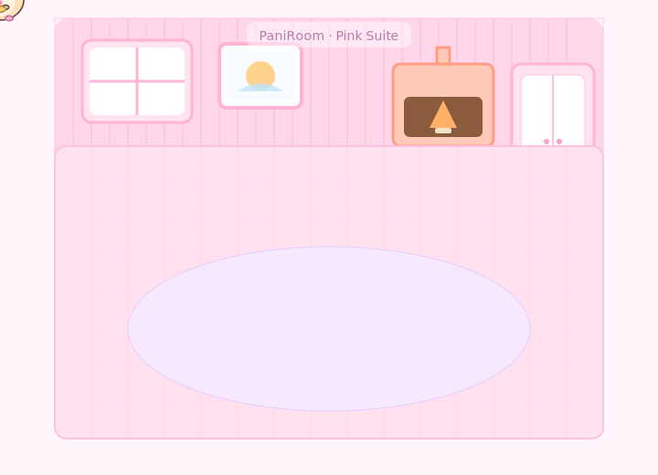

# 🐹 파니룸 (PaniRoom)
내 README 속 작은 방—햄스터가 산책 중입니다.

  

---

## 어떻게 만든 거야?
- GitHub README는 **JavaScript/CSS가 제한**돼요. 대신 **SMIL 애니메이션이 들어간 SVG**를 이미지처럼 걸면 자연스럽게 움직입니다.
- 외부 의존성 없이 **순수 SVG 1개**만으로 동작해요.

## 커스터마이즈 (빠르게)
- **속도**: `dur="18s"` → 숫자를 줄이면 빨라져요.
- **크기**: README 안 `` 값 조절.
- **햄스터 크기**: SVG 내부 `id="hamster"`에 `transform="scale(…)"` 값 조절.
- **동선**: `id="walk-path"`의 `d="…"`(path) 경로를 수정하면 됩니다. (방 배치도 변경 가능)

## 호환 & 팁
- 최신 크롬/파이어폭스/사파리에서 동작.
- GitHub 다크모드에서도 잘 보이도록 **배경 포함**.
- 더 역동적으로 만들고 싶다면, 향후 GitHub Actions로 하루 한 번 **무작위 경로 SVG 생성** → README 갱신도 가능해요.

